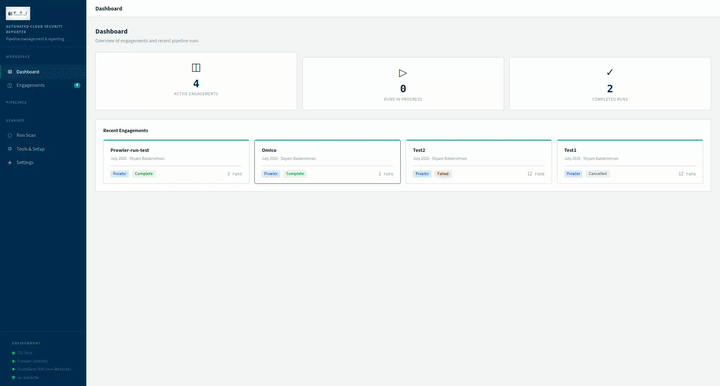
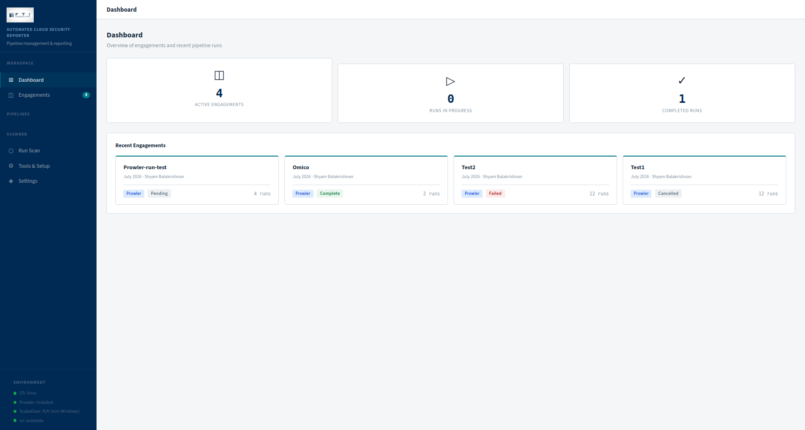
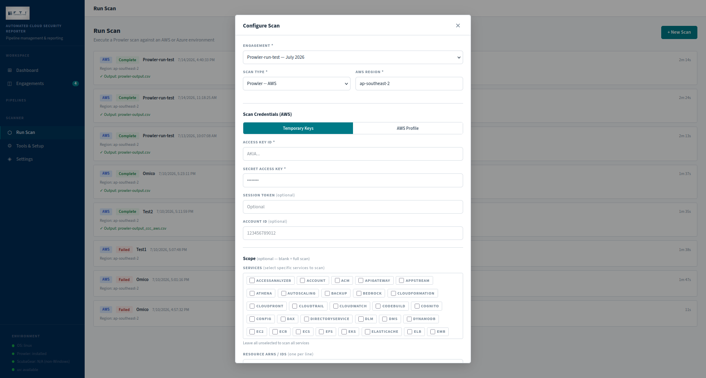
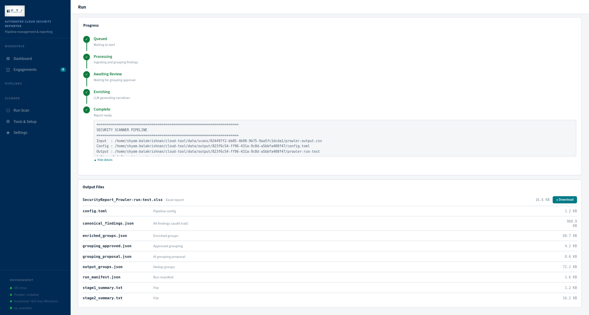
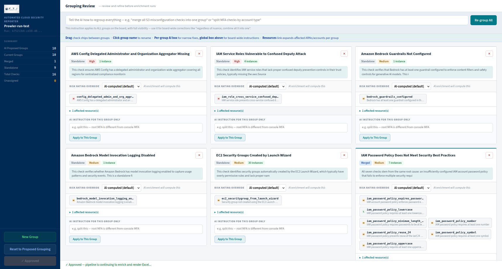
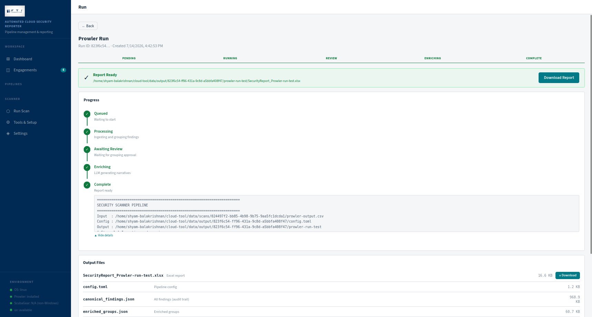

# FTI - Automated Cloud Security Reporter


> A one-stop platform for cloud security assessments , runs Prowler and ScubaGear scans with a click of a button, groups findings with AI, guides analyst review, and produces client-ready Excel reports automatically.




---

## Screenshots

| View | Preview |
|------|---------|
| Dashboard |  |
| New Scan |  |
| Live Pipeline Progress |  |
| Grouping Review UI |  |
| Completed Report |  |

---

## Table of Contents

- [Features](#features)
- [How It Works](#how-it-works)
- [Tech Stack](#tech-stack)
- [Prerequisites](#prerequisites)
- [Installation](#installation)
- [Running the Project](#running-the-project)
- [Environment Variables](#environment-variables)
- [GUI Walkthrough](#gui-walkthrough)
- [CLI Usage](#cli-usage)
- [Configuration](#configuration)
- [Project Structure](#project-structure)
- [Security Considerations](#security-considerations)
- [Troubleshooting](#troubleshooting)

---

## Features

### Scanning
- **Prowler** - run AWS and Azure infrastructure scans directly from the GUI with per-scan credentials
- **ScubaGear** - launch M365 / Entra ID scans via ScubaGear's own UI, auto-detect output (Windows only)
- Service-level scoping for Prowler (select specific AWS/Azure services)
- Resource ARN scoping for targeted assessments

### Pipeline
- Ingests Prowler CSV/XLSX/JSON/OCSF and ScubaGear `ActionPlan.csv`
- Deduplicates findings using stable cross-scan fingerprints
- Semantic grouping via Claude on AWS Bedrock -- merges related check types into findings
- **Human-in-the-loop review** - drag-and-drop grouping board with per-group AI instructions
- LLM enrichment: title, root cause, situation, consequence, risk rating, recommendations
- Risk matrix: likelihood x consequence, with manual override support

### Reporting
- Outputs a formatted Excel report from a pre-defined FTI template
- Risk colour coding (High / Medium / Low)
- Empty M365 service sections omitted automatically
- Sequential finding references per service (ENT1, DEF1, EXO1...)

### GUI
- Engagement management - multiple clients, multiple runs per engagement
- Live pipeline progress timeline (stage-by-stage, not raw terminal)
- SSE-based real-time streaming - no polling delays
- Run history and risk distribution comparison across runs
- Output file browser with one-click Excel download
- Settings page with persistent defaults (region, deployment name, credentials)

---

## How It Works

```
Scanner Output
      |
      v
Stage 1 -- Ingest
  Parse CSV/XLSX/JSON/OCSF into CanonicalFinding objects
      |
      v
Stage 2 -- Process
  Filter (FAIL only) -> Deduplicate -> Group by check_id
      |
      v
Stage 2.5 -- AI Grouping (Claude via Bedrock)
  Semantic merge of related check types across the environment
      |
      v
Review UI -- Analyst Approval
  Drag-and-drop board, risk overrides, AI re-prompting per group
      |
      v
Stage 3 -- LLM Enrichment (Claude via Bedrock)
  Generate narratives, consequence ratings, recommendations
      |
      v
Stage 5 -- Excel Render
  Populate Output_Template.xlsx with colour-coded findings
```

---

## Tech Stack

| Layer | Technology |
|-------|-----------|
| GUI backend | Python 3.11+, FastAPI, uvicorn |
| GUI frontend | Vanilla JS SPA, Server-Sent Events |
| Database | SQLite via aiosqlite |
| Pipeline | Python 3.9-3.12 |
| LLM | Claude via AWS Bedrock Converse API |
| AWS scanner | Prowler v5 (Python, installed via uv) |
| M365 scanner | ScubaGear v1.8+ (PowerShell module, Windows only) |
| Excel output | openpyxl |
| Config | TOML (tomllib stdlib) |
| Dependency management | uv |

---

## Prerequisites

| Requirement | Version | Notes |
|-------------|---------|-------|
| Python | 3.11+ (GUI), 3.9-3.12 (pipeline) | Prowler does not support Python 3.13+ |
| uv | Any | Installed automatically by startup script |
| AWS account | -- | Bedrock access required, zero-data-retention recommended |
| Git | Any | |

### Windows only (ScubaGear)

| Requirement | Notes |
|-------------|-------|
| PowerShell 5.1+ | Pre-installed on Windows 10/11 |
| ScubaGear v1.8+ | Install locally, NOT inside OneDrive |
| OPA binary | Installed via `Initialize-SCuBA` |
| PowerShell execution policy | `RemoteSigned` at `CurrentUser` scope |

### Enable Windows long paths (required, one-time, admin PowerShell)

```powershell
Set-ItemProperty -Path "HKLM:\SYSTEM\CurrentControlSet\Control\FileSystem" `
  -Name "LongPathsEnabled" -Value 1
```

---

## Installation

### Option A -- Startup script (recommended)

**Linux / macOS**
```bash
git clone https://github.com/shyam-balakrishnan-fti/Automated-CloudSec-Reporter
cd Automated-CloudSec-Reporter
bash gui/start.sh
```

**Windows (right-click -> Run with PowerShell, or)**
```powershell
git clone https://github.com/shyam-balakrishnan-fti/Automated-CloudSec-Reporter
cd Automated-CloudSec-Reporter
powershell -ExecutionPolicy Bypass -File gui\start.ps1
```

The script handles everything:
- Detects OS and Python version
- Installs uv if missing(Dependency and Python Version Management)
- Installs Prowler via `uv tool install prowler --python 3.12`
- Installs ScubaGear dependencies via `Initialize-SCuBA` (Windows)
- Creates root `.venv` with pipeline dependencies
- Syncs GUI dependencies
- Opens browser at `http://localhost:8000`

On subsequent launches the script skips already-installed tools.

### Option B -- Manual setup

```bash
# 1. Clone
git clone https://github.com/your-org/cloud-tool.git
cd cloud-tool

# 2. Install pipeline dependencies
uv venv .venv --python 3.12
uv pip install --python .venv/bin/python openpyxl pydantic boto3 tomli

# 3. Install Prowler
uv tool install prowler --python 3.12

# 4. Install GUI dependencies
cd gui
uv sync

# 5. Set environment variables (see Environment Variables section)

# 6. Start
uv run python main.py
```

---

## Running the Project

### Start the GUI

```bash
cd gui
uv run python main.py
# Opens at http://localhost:8000
```

> Do NOT use `uvicorn main:app --reload` -- the file watcher restarts the server mid-run, killing active pipeline subprocesses.

### Run a pipeline directly (CLI)

**Prowler**
```bash
cd cloud-tool
source .venv/bin/activate
python src/run_pipeline.py \
  --input path/to/prowler-output.csv \
  --config config/config.toml \
  --format auto
```

**ScubaGear**
```bash
python scubagear/src/run_scubagear.py \
  --action-plan path/to/ActionPlan.csv \
  --config scubagear/config/scubagear_config.toml \
  --tenant-id xxxxxxxx-xxxx-xxxx-xxxx-xxxxxxxxxxxx
```
## Exposure Scanner

Enumerates every publicly accessible resource across AWS and Azure using direct read-only API calls. Independent from Prowler and ScubaGear , no external tools required.

### AWS Coverage (14 services)

| Service | What is checked | Severity |
|---------|----------------|---------|
| S3 | Public access block disabled, bucket policy allows `*` | High |
| Security Groups | Ingress `0.0.0.0/0` on sensitive ports (22, 3389, 5432, 3306, 1433) | High |
| RDS | `PubliclyAccessible=True` | High |
| Lambda | Function URL with `AuthType=NONE` | High |
| ECR | Repository policy allows public pull | High |
| EBS Snapshots | Snapshot shared publicly | High |
| Secrets Manager | Resource policy allows `*` principal | High |
| OpenSearch | Access policy allows `*` principal | High |
| EC2 | Instance has public IP assigned | Medium |
| ELB / ALB / NLB | Load balancer is internet-facing | Medium |
| EKS | API server endpoint is publicly accessible | Medium |
| SQS | Queue policy allows `*` principal | Medium |
| SNS | Topic policy allows `*` principal | Medium |
| Redshift | `PubliclyAccessible=True` | High |

### Azure Coverage (9 services)

| Service | What is checked | Severity |
|---------|----------------|---------|
| SQL Server | Public network access enabled, firewall allows all IPs | High |
| Key Vault | Publicly accessible with no network restrictions | High |
| Cosmos DB | `publicNetworkAccess=Enabled` | High |
| Storage | Blob public access enabled, no network restrictions | High |
| NSG | Inbound rule allowing `*` or `Internet` on sensitive ports | High |
| Virtual Machines | Public IP address assigned | Medium |
| AKS | API server is not private cluster | Medium |
| Container Registry | Admin user enabled, public access allowed | Medium |
| App Services | HTTPS not enforced | Medium |

### How to run

1. Go to **Exposure** in the sidebar
2. Click **+ New Scan**
3. Select cloud provider (AWS or Azure)
4. Enter scan credentials - these are separate from Bedrock credentials and vary per client
5. Select regions (AWS) or subscription ID (Azure)
6. Choose services to scan - all selected by default
7. Click **Start Scan**

The scan streams live progress per service. When complete, results appear in a filterable table.

### Filtering and export

Results can be filtered by service, severity, and region. Export as CSV or Excel using the buttons above the results table. The Excel export colour-codes rows by severity (High = red, Medium = amber, Low = green).

### Credentials required

**AWS** -- Access Key ID + Secret Access Key with read-only IAM permissions across the services being scanned. Session token optional for MFA or assumed role sessions.

**Azure** -- Service Principal with Reader role on the target subscription. Requires Tenant ID, Client ID, Client Secret, and Subscription ID.
---

## Environment Variables

Set these in `gui/start.sh` (Linux/macOS) or `gui/start.ps1` (Windows) before the launch step.

| Variable | Required | Description |
|----------|----------|-------------|
| `BEDROCK_DEPLOYMENT_NAME` | Yes | Private inference profile ARN |
| `AWS_ACCESS_KEY_ID` | Yes | AWS access key for Bedrock calls |
| `AWS_SECRET_ACCESS_KEY` | Yes | AWS secret key |
| `AWS_DEFAULT_REGION` | Yes | Default: `ap-southeast-2` |
| `AWS_SESSION_TOKEN` | No | For MFA / assumed role sessions |

**Linux/macOS (`start.sh`)**
```bash
BEDROCK_DEPLOYMENT_NAME="arn:aws:bedrock:ap-southeast-2:123456789:your-profile"
export BEDROCK_DEPLOYMENT_NAME
AWS_ACCESS_KEY_ID="AKIA..."
export AWS_ACCESS_KEY_ID
AWS_SECRET_ACCESS_KEY="your-secret"
export AWS_SECRET_ACCESS_KEY
AWS_DEFAULT_REGION="ap-southeast-2"
export AWS_DEFAULT_REGION
```

**Windows (`start.ps1`)**
```powershell
$env:BEDROCK_DEPLOYMENT_NAME = "arn:aws:bedrock:ap-southeast-2:123456789:your-profile"
$env:AWS_ACCESS_KEY_ID        = "AKIA..."
$env:AWS_SECRET_ACCESS_KEY    = "your-secret"
$env:AWS_DEFAULT_REGION       = "ap-southeast-2"
```

---

## GUI Walkthrough

### 1. First-time setup
- Open **Tools & Setup** in the sidebar
- Install any missing tools (Prowler, ScubaGear)
- Open **Settings** and verify AWS region and Bedrock deployment name

### 2. Create an engagement
- **Engagements -> New Engagement**
- Fill in client name, assessment period, analyst, pipeline type

### 3. Run a scan (optional)
- **Run Scan -> New Scan**
- Select scan type: Prowler AWS, Prowler Azure, or ScubaGear M365
- Enter scan credentials (separate from Bedrock credentials)
- For ScubaGear: follow the on-screen path instructions in the ScubaGear window
- When complete, click **Generate Report ->**

### 4. Configure a run
- Open an engagement -> **+ New Run**
- Set input file (auto-populated if coming from a scan)
- Click **Check Preflight** to validate before starting

### 5. Monitor progress
The run detail view shows a timeline:
```
Queued -> Processing -> Awaiting Review -> Enriching -> Complete
```

### 6. Grouping review
- Review UI opens in a new browser tab when the pipeline pauses
- Drag finding chips between group cards to reorganise
- Apply AI instructions per group or board-wide
- Override risk ratings as needed
- Click **Approve** to resume the pipeline

### 7. Download report
- **Report Ready** banner appears on completion
- Click **Download Report** for the Excel file
- **Output Files** panel lists all generated checkpoints

---

## CLI Usage

### Prowler flags

| Flag | Description |
|------|-------------|
| `--input`, `-i` | Path to Prowler output file (required) |
| `--config`, `-c` | Path to config.toml |
| `--format`, `-f` | `auto` / `csv` / `xlsx` / `json` |
| `--output-dir` | Output directory |
| `--skip-llm` | Skip AI grouping and enrichment |
| `--skip-review` | Auto-approve grouping |
| `--force-review` | Ignore existing approval file |
| `--no-browser` | Suppress review UI auto-launch |

### ScubaGear flags

| Flag | Description |
|------|-------------|
| `--action-plan` | Path to ActionPlan.csv (required) |
| `--config` | Path to scubagear_config.toml |
| `--tenant-id` | Azure tenant UUID |
| `--output-dir` | Output directory |
| `--skip-review` | Auto-approve grouping |
| `--skip-grouping` | Skip semantic grouping stage |
| `--no-browser` | Suppress review UI auto-launch |

---

## Configuration

### `config/config.toml` -- edit before each Prowler run

```toml
[engagement]
client_name       = "Acme Corp"
assessment_period = "July 2026"
analyst           = "Your Name"
output_filename   = "SecurityReport.xlsx"

[llm]
provider        = "bedrock_runtime"
deployment_name = "arn:aws:bedrock:ap-southeast-2:123456789:your-profile"
aws_region      = "ap-southeast-2"
max_tokens      = 1500
timeout_seconds = 60
```

> When using the GUI, config files are generated automatically. Manual editing is only needed for CLI usage.

### `scubagear/config/scubagear_config.toml` -- ScubaGear equivalent

Same structure, with additional `tenant_id` and `[service_map]` sections. See the file for full reference.

---

## Project Structure

```
cloud-tool/
|-- config/
|   `-- config.toml                   Prowler pipeline configuration
|-- src/                              Prowler pipeline
|   |-- models.py                     CanonicalFinding data model
|   |-- stage1_ingest.py              CSV/XLSX/JSON/OCSF ingestion
|   |-- stage2_process.py             Filter, deduplicate, group
|   |-- stage2_5_grouping.py          Semantic grouping (LLM)
|   |-- stage_reviewer.py             Grouping review UI (port 8742)
|   |-- stage3_llm.py                 LLM enrichment
|   |-- stage5_render_excel.py        Excel renderer
|   `-- run_pipeline.py               Orchestrator + CLI
|-- scubagear/
|   |-- config/
|   |   `-- scubagear_config.toml
|   `-- src/                          ScubaGear pipeline (mirrors above)
|       `-- run_scubagear.py          Orchestrator + CLI
|-- templates/
|   `-- Output_Template.xlsx          Excel template
|-- gui/                              Web GUI
|   |-- main.py                       FastAPI entry point
|   |-- start.sh                      Linux/macOS launcher
|   |-- start.ps1                     Windows launcher
|   |-- pyproject.toml                GUI dependencies (uv)
|   |-- api/
|   |   |-- config_writer.py          Generates config.toml per run
|   |   |-- installer.py              Tool installation (Prowler, ScubaGear)
|   |   |-- platform.py               OS detection, preflight checks
|   |   |-- routes.py                 All API route handlers
|   |   |-- runner.py                 Pipeline subprocess + SSE streaming
|   |   |-- scanner.py                Prowler/ScubaGear scan execution
|   |   `-- sse.py                    Server-Sent Events infrastructure
|   |-- db/
|   |   |-- database.py               SQLite connection + migrations
|   |   `-- schema.sql                Table definitions
|   |-- static/
|   |   `-- logo.jpeg                 Company logo
|   `-- templates/
|       `-- index.html                Single-page application
`-- tests/                            Pipeline tests
```

---

## Security Considerations

### Credentials
- AWS scan credentials are held in memory only for the duration of the subprocess , never written to the database
- Raw keys entered in the GUI are marked `exclude=True` on the Pydantic model , they cannot appear in logs or serialised responses
- Bedrock credentials come from environment variables set in the startup script , never hardcoded in application code
- The GUI runs on `127.0.0.1` (localhost only) , not exposed to the network by default

### Data
- All pipeline output (findings, enriched narratives, Excel reports) stays on the local filesystem
- AWS Bedrock zero-data-retention should be enabled at the account level before use(the current account that this tool is configured with is already configured with Zero Operator Access and Zero Data Retention ):
  ```bash
  aws bedrock put-account-data-retention --mode none --region ap-southeast-2
  ```
- The SQLite database stores run metadata and log lines , no raw finding content or credentials

### Input validation
- All API request bodies validated via Pydantic before processing
- Input file paths validated for existence and readability in preflight checks
- Output directories validated for write access before runs start

### Audit trail
- Every field change on every finding is recorded with timestamp, actor, old value, new value
- Run logs are stored append-only in `scan_logs` / `run_logs` tables
- Full stdout replay available for any completed run

---

## Troubleshooting

### Prowler fails with pandas build error (Windows)
Prowler requires Python 3.12 or below. The startup script handles this with `--python 3.12`.
```powershell
uv tool install prowler --python 3.12 --link-mode copy
```

### UnicodeEncodeError on Windows
The GUI sets `PYTHONIOENCODING=utf-8` automatically. For CLI usage:
```powershell
$env:PYTHONIOENCODING = "utf-8"
$env:PYTHONUTF8 = "1"
```

### OneDrive hardlink error (os error 396)
```powershell
$env:UV_LINK_MODE = "copy"
$env:UV_CACHE_DIR = "C:\uv-cache"
```

### ScubaGear -- powershell-yaml missing
```powershell
powershell -ExecutionPolicy Bypass -Command "Import-Module ScubaGear -Force; Initialize-SCuBA"
```

### Pipeline stuck in Queued
The server was started with `--reload`. Always use:
```bash
uv run python main.py
```

### Excel path too long (Windows)
Enable long path support (admin PowerShell, one-time):
```powershell
Set-ItemProperty -Path "HKLM:\SYSTEM\CurrentControlSet\Control\FileSystem" `
  -Name "LongPathsEnabled" -Value 1
```

### deployment_name is required
Set in **Settings** in the GUI, or add to your startup script:
```powershell
$env:BEDROCK_DEPLOYMENT_NAME = "arn:aws:bedrock:REGION:ACCOUNT:your-profile"
```

### ScubaGear not found by GUI
ScubaGear must be installed outside OneDrive. The GUI searches `$env:USERPROFILE` recursively for `ScubaGear.psd1` -- install it to a local (non-synced) path.

# Credits
Shyam Balakrishnan,
Intern,
Cyber, FTI Consulting